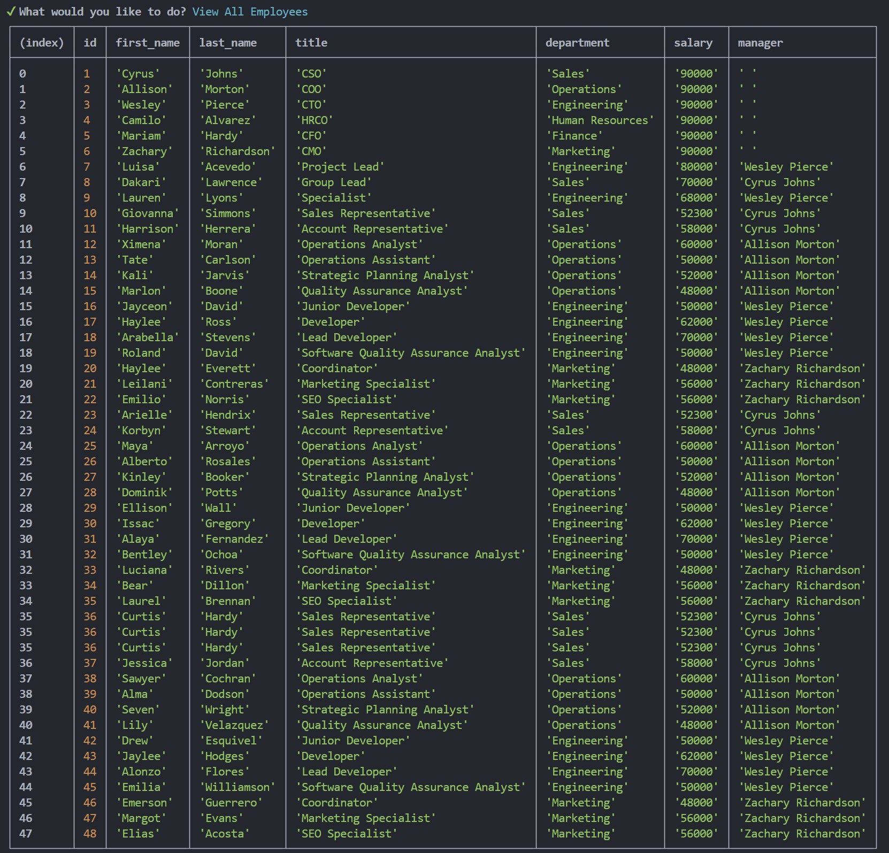

# Employee Management DB + Interface
[](https://opensource.org/licenses/MIT)

## Description
A CLA designed from scratch to create an employee management database that can be directly interacted with using Node.js, Inquirer, and PostgreSQL.


## Table of Contents
- [Installation](#installation)
- [Usage](#usage)
- [License](#license)
- [Contributing](#contributing)
- [Tests](#tests)
- [Questions](#questions)

## Installation
Note: Requires PostgreSQL, which can be installed from the [PostgreSQL website](https://www.postgresql.org/download/).

Clone the repository.

In the terminal, navigate to the root folder and run the following command to install dependencies:
```
npm i
```

In the terminal, navigate the db folder and start a psql instance by typing:
```
psql -U postgres
```

Run the following commands within the psql instance:
(Note: seeds.sql will populate mock data. Do not run this file if you wish to start with an empty database.)
```
\i schema.sql
\i seeds.sql
```

In the terminal, navigate to the root folder and type the following commands to build and run the application:
```
npx tsc
node dist/index.js
```


## Usage
[Walkthrough Video]()
  
The Main Menu of the application displays options for viewing all deparments, roles, and employees. Departments, roles, and employees can also be added. Employees can be updated.


Viewing all departments will display the ID and Name of all existing departments. 

Viewing all roles will display the ID, Title, Salary, and Department data associated with all existing roles. 

Viewing all employees will display the ID, First Name, Last Name, Title, Department, Salary, and Manager data associated with all existing roles. 

Using the prompts provided, departments, roles, and employees may be added. Depending on your selection, all required data can be entered via subsequent prompts.


## License
This project is licensed under the MIT license. For more details, see the license link: (https://opensource.org/licenses/MIT)

## Contributing
As this is a project strictly for educational purposes, no contributions will be accepted.

## Tests
There are currently no tests implemented in this program at this time.

## Questions
##### For any questions regarding this project, contact the project owner via: 
GitHub: [apoborka](https://github.com/apoborka)\
Email: alex.poborka@example.com

## Acknowledgments
This project utilized GitHub Copilot.

This project utilized EdX's Xpert Learning Assistant.

Mock employee data was created using [1000 Random Names](https://1000randomnames.com/).